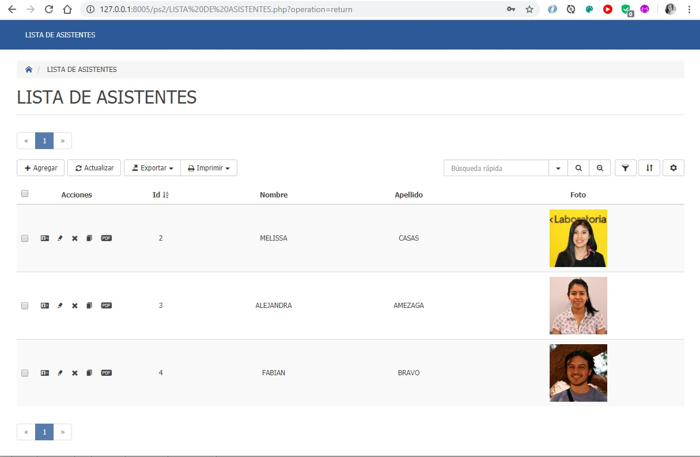
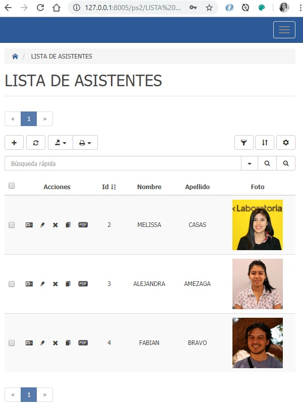

# Título de la charla

_Cómo crear un CRUD en 10 minutos usando PHP Generator 

## ¿Cómo acceder a la presentación?

Solo debes ingresar →  [**_AQUÍ_**](https://docs.google.com/presentation/d/1rCYjVz1BDCGLgp7-LTFF2AMB6fvtsUawbTsLRqDcCfk/edit#slide=id.p) 

## Construido con 🛠️

_Las siguientes herramientas_

* [Oracle Express 11g](https://www.oracle.com/technetwork/es/database/express-edition/overview/index.html) - El gestos de base de datos
* [Toadf for Oracle](http://www.toadworld.com/products/toad-for-oracle) - Software de administración de bases de datos 
* [Oracle PHP Generator](https://www.sqlmaestro.com/products/oracle/phpgenerator/) - Usado para generar PHP Scripts
* [XAMPP](https://www.apachefriends.org/es/index.html) 

## Galeria

---
⌨️ con ❤️ por [Melissa Casas](https://github.com/marimeli) 😊
